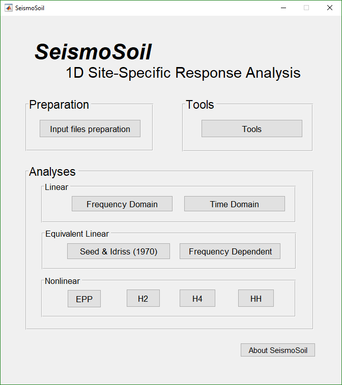
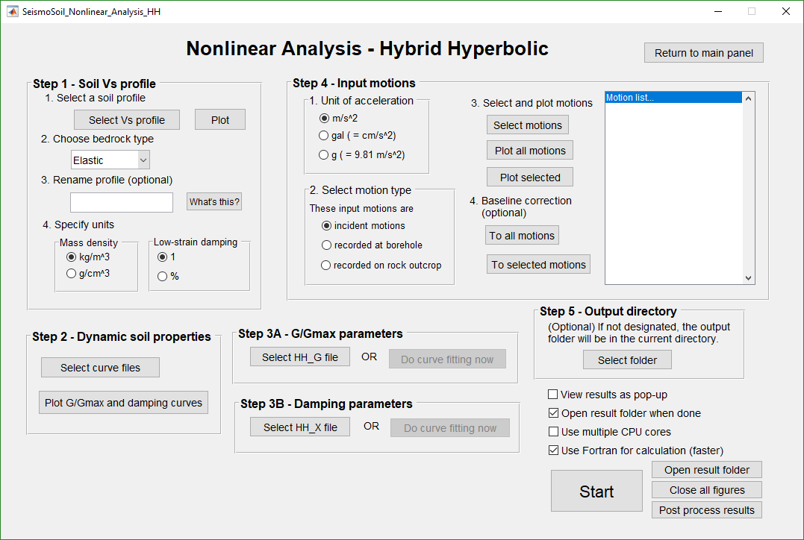
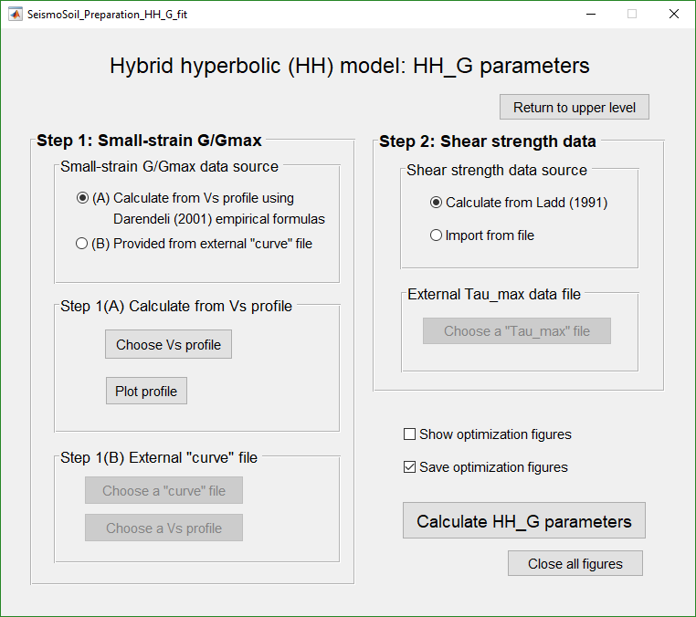

# *SeismoSoil* user's manual
*SeismoSoil* is a software package that performs **1D seismic site response analysis**.

This repository is the manual for *SeismoSoil*.

### Selected screenshots of *SeismoSoil*

The main panel: 

Site response analysis panel (nonlinear method)  

Hybrid hyperbolic (HH) model calibration:

Simulation results: profiles of peak acceleration, velocity, displacement, strain, and stress
_max_a_v_d_gamma_tau.png)
